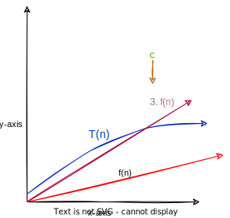

# Big-O notation

## Big-O Notation (English Definition)

T (n) = O(f (n)) if and only if T (n) is eventually bounded
above by a constant multiple of f (n).

## Big-O Notation (Pictorial Definition)

"A picture illustrating when T (n) = O(f (n)). The constant c
quantifies the “constant multiple” of f (n), and the constant n0 quantifies
“eventually.”"

## Big-O Notation (Mathematical Definition)

T (n) = O(f (n)) if and only if there exist positive constants
c and n0 such that

T (n) <= c · f (n)

for all n >= n0 

## Big-Omega Notation (Mathematical Version)

T (n) = $\Omega$(f (n)) if and only if there exist positive constants
c and n0 such that:   T (n) >= c.f(n)

for all n >= n0
